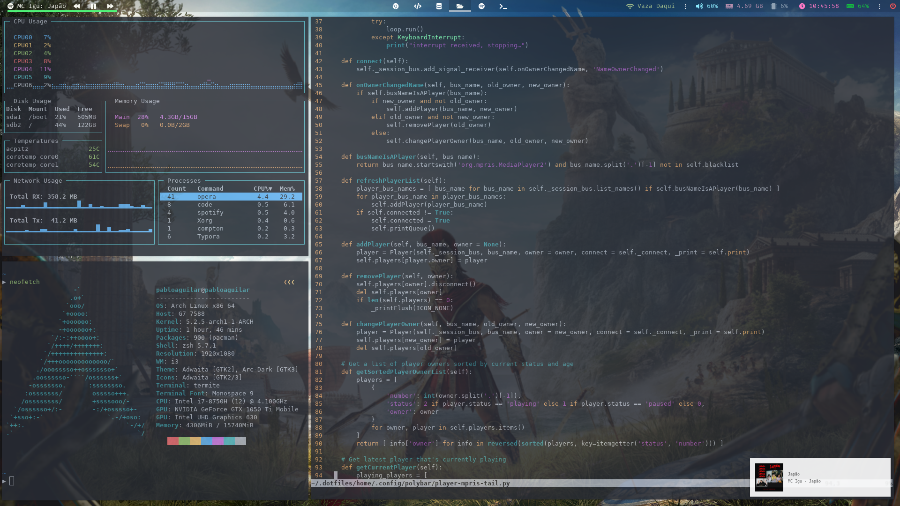

# My .dotfiles

My setup:

* Distro: [Arch Linux](https://www.archlinux.org)

* Windows Manager: [i3-gaps](https://github.com/Airblader/i3)

* GTK Theme: [Arc-Dark](https://github.com/horst3180/arc-theme)

* Compositor: [Compton](https://github.com/chjj/compton)

* Notification Daemon: [Dunst](https://dunst-project.org)

* Terminal: [Alacritty](https://github.com/alacritty/alacritty)



To setup .dotfiles to home directory, execute the following commands:

```sh
    git clone git@github.com:phakiller/dotfiles.git
    cd dotfiles
    ./setup-dotfiles
```

# Special Thanks

Many thanks to [bruno-delfino1995](https://github.com/bruno-delfino1995), that showed to me this wonderful trick with .dotfiles and provided a shell script to put .dotfiles in their right place.

Thanks to the best subreddit, [r/unixporn](https://www.reddit.com/r/unixporn/), I was inspired in many posts and reuse some files from there to make these dotfiles.
